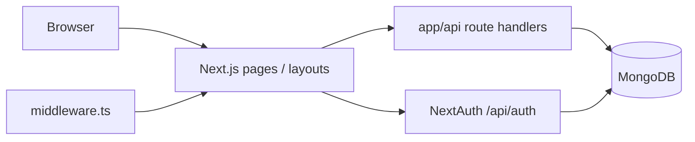

# MisterWheels CRM — System Documentation

This document explains what the system is, how it is built, how data and security work, and how to operate it day to day. It is intended for developers and technical operators. For feature marketing-style lists, see `README.md`. For folder layout and conventions, see `ARCHITECTURE.md`.

---

## 1. Purpose

**MisterWheels CRM** is a web application for managing a car rental business: fleet (“units”), customers, bookings, money flow (invoices, payments, expenses, salaries, investor payouts), maintenance, reporting, users, and support. Staff sign in through a browser; the UI talks to **Next.js API routes** that read and write **MongoDB** through **Mongoose** models.

---

## 2. Technology Stack

| Layer | Technology |
|--------|------------|
| Application framework | **Next.js 14** (App Router) |
| Language | **TypeScript** |
| UI | **React 18**, **Tailwind CSS** |
| Forms & validation | **React Hook Form**, **Zod** |
| Server / API | Next.js **Route Handlers** under `app/api/` |
| Data access (runtime) | **MongoDB** + **Mongoose** |
| Secondary tooling (optional) | **Prisma** (`prisma/schema.prisma`) for `db push` / `generate` / Studio — schemas do not need to match every Mongoose collection; the **live app uses Mongoose** |
| Auth | **NextAuth.js v4** (Credentials provider, **JWT** sessions) |
| Client data fetching | **TanStack React Query** (e.g. notifications in the top bar) |
| PDF / exports | **PDFKit**, **jsPDF**, **ExcelJS** (depending on route) |
| Icons | **Lucide React** |

---

## 3. High-Level Architecture

- **`app/page.tsx`** redirects `/` to **`/login`**.
- **Public:** `/login` (and static assets).
- **Protected:** Almost everything else under `app/(protected)/` — wrapped by **`AppShell`** (sidebar + top bar). **`middleware.ts`** enforces authentication and **ACTIVE** user status before serving those routes.
- **API:** Under `app/api/` — many modules (bookings, vehicles, invoices, etc.). NextAuth lives at **`app/api/auth/[...nextauth]/route.ts`** and uses **`lib/authOptions.ts`**.

---

## 4. Authentication and Sessions

### 4.1 Flow

1. User submits email and password on `/login`.
2. NextAuth **Credentials** provider runs **`authorize`** in `lib/authOptions.ts`: connects to MongoDB, loads **`User`** by email, checks **`status === 'ACTIVE'`**, verifies **`passwordHash`** with **bcrypt**.
3. On success, NextAuth issues a **JWT** containing `id`, `role`, and `status` (see callbacks in `authOptions.ts`).
4. Session is exposed to the client via `useSession()` and to the server via `getServerSession(authOptions)`.

### 4.2 Middleware (`middleware.ts`)

- Uses **`withAuth`** from `next-auth/middleware`.
- **`/login`** is always allowed.
- Other matched routes require a valid token and **`token.status === 'ACTIVE'`**; inactive users are redirected to `/login?error=inactive`.
- Paths starting with **`api`**, **`_next`**, **`favicon.ico`**, **`login`**, and common image extensions are excluded from the matcher so API and assets are not blocked incorrectly.

### 4.3 Roles

Defined on the **`User`** model (`lib/models/User.ts`), including:

`SUPER_ADMIN`, `ADMIN`, `MANAGER`, `SALES_AGENT`, `FINANCE`, `INVESTOR`, `CUSTOMER`

Helpers such as **`hasRole`**, **`isAdmin`**, **`isSuperAdmin`** live in **`lib/auth.ts`**. Individual API routes enforce who may call them.

### 4.4 Session utilities

- **`getCurrentUser()`** — loads the MongoDB user for the current session (used heavily in APIs).
- Session typing extensions: **`types/next-auth.d.ts`**.

---

## 5. Data Layer (MongoDB + Mongoose)

### 5.1 Connection (`lib/db.ts`)

- Singleton-style Mongoose connection with caching across hot reloads in development.
- Connection string resolution order: **`MONGODB_URI`**, then **`DATABASE_URL`**, then **`MONGODB_URL`** (typo tolerance).
- Pool and timeout settings are tuned for serverless-friendly behavior.

### 5.2 Primary models (`lib/models/`)

The application persists business data through Mongoose. Core collections include (non-exhaustive but representative):

| Model | Typical responsibility |
|--------|------------------------|
| `User` | Staff/customer accounts, roles, `passwordHash`, `status` |
| `CustomerProfile` | Rental customers |
| `Vehicle` | Fleet / units |
| `Booking` | Rentals, statuses, payment/deposit semantics |
| `Invoice` / `Payment` | Billing and payment records |
| `Expense` / `ExpenseCategory` / `RecurringExpense` | Operating costs |
| `SalaryRecord` | Payroll-related entries |
| `InvestorProfile` / `InvestorPayout` | Investor reporting and payouts |
| `MaintenanceRecord` / `MaintenanceSchedule` | Fleet maintenance |
| `MileageHistory` | Odometer tracking |
| `FineOrPenalty` | Fines tied to vehicles |
| `Document` | File metadata / links |
| `Notification` | In-app notifications |
| `SupportTicket` | Support workflow |
| `Settings` | System configuration |
| `Role` | Custom roles (optional use alongside enum roles) |
| `DashboardWidget` | Dashboard layout preferences |
| `ActivityLog` / `AuditLog` / `ExportLog` | Auditing and exports |
| `ReportPreset` | Saved report filters |
| `Session` | Custom session store if used |

Exact fields and indexes are defined in each `*.ts` schema file.

### 5.3 Prisma (`prisma/schema.prisma`)

Prisma is present for tooling (`npm run db:generate`, `db:push`, `db:studio`). **Routine requests in this app use Mongoose**, not Prisma Client, unless you have added separate usage. Keep **`DATABASE_URL`** valid if you use Prisma CLI commands.

---

## 6. Application Structure (UI Routes)

Protected screens live under **`app/(protected)/`**, for example:

- **Dashboard** — `dashboard/`
- **Bookings** — `bookings/`
- **Units (vehicles)** — `units/`
- **Clients** — `clients/`
- **Financials** — `financials/` (invoices, expenses, salaries, recurring expenses, investor payouts, reports, profit and loss, etc.)
- **Investors** — `investors/`
- **Maintenance** — `maintenance/`
- **Users** — `users/`
- **Roles / permissions** — `roles/`, `settings/permissions/`, `settings/roles/`
- **Settings** — `settings/`
- **Support** — `support/`

Login is under **`app/(auth)/login/`** or equivalent path used by your tree (`/login`).

---

## 7. API Surface

REST-style handlers under **`app/api/`** mirror domains: bookings, customers, vehicles, invoices, payments, expenses, maintenance, reports, exports, notifications, users, roles, settings, admin utilities, etc.

Common patterns:

- **`getServerSession(authOptions)`** for authentication.
- **`getCurrentUser()`** + **`hasRole`** (or similar) for authorization.
- **`connectDB()`** before Mongoose operations.
- JSON responses with appropriate HTTP status codes.

Some routes are intended for **cron or trusted callers** and may check API keys such as **`RECURRING_EXPENSE_API_KEY`** or **`MAINTENANCE_CHECK_API_KEY`** (see respective route files).

---

## 8. Environment Variables

Place variables in **`.env`** or **`.env.local`** in the **same directory as `package.json`**. Next.js loads both; **`.env.local` overrides `.env`**.

| Variable | Purpose |
|-----------|---------|
| **`MONGODB_URI`** | Primary MongoDB URI for Mongoose |
| **`DATABASE_URL`** | Same cluster URI if you use Prisma CLI or as a fallback for Mongoose |
| **`MONGODB_URL`** | Optional typo fallback (supported in `lib/db.ts`); prefer **`MONGODB_URI`** |
| **`NEXTAUTH_SECRET`** | Strong secret for signing JWTs (generate e.g. with `openssl rand -base64 32`) |
| **`NEXTAUTH_URL`** | Public base URL of the app (e.g. `http://localhost:3000` in dev) |
| **`SUPER_ADMIN_EMAIL`** / **`PASSWORD`** / **`NAME`** | Optional overrides for `npm run seed:admin` |
| **`RECURRING_EXPENSE_API_KEY`** | Protects recurring-expense processing endpoint if set |
| **`MAINTENANCE_CHECK_API_KEY`** | Protects maintenance check endpoint if set |
| **`CACHE_TTL`** / **`CACHE_MAX_SIZE`** | Optional tuning for in-app cache helpers |

See **`.env.example`** for a template without secrets.

---

## 9. NPM Scripts

| Script | Meaning |
|--------|---------|
| `npm run dev` | Development server (default port 3000) |
| `npm run build` | Production build |
| `npm start` | Run production build |
| `npm run lint` | ESLint |
| `npm run db:generate` | Prisma Client generate |
| `npm run db:push` | Push Prisma schema to MongoDB (tooling) |
| `npm run db:studio` | Prisma Studio |
| `npm run seed:admin` | Create initial super admin in MongoDB |
| `npm run optimize` | Performance script (`scripts/optimizePerformance.ts`) |
| `npm run clear:db` | Danger: clear database script — use only with care |

---

## 10. First-Time Setup (Checklist)

1. Install **Node.js** (v18+ recommended).
2. **`npm install`** in the project root (where `package.json` lives).
3. Create **`.env`** / **`.env.local`** with **`MONGODB_URI`** (or **`DATABASE_URL`**) and **`NEXTAUTH_SECRET`**, **`NEXTAUTH_URL`**.
4. Ensure MongoDB Atlas **IP allowlist** and **user credentials** are correct.
5. **`npm run seed:admin`** to create the first admin if no user exists (or create users via your process).
6. **`npm run dev`** and open **`NEXTAUTH_URL`**.

---

## 11. Performance, Caching, and Sessions

Additional focused docs in the repo:

- **`README_PERFORMANCE.md`** — performance practices.
- **`README_CACHE.md`** — caching behavior.
- **`README_SESSIONS.md`** — session-related notes.

---

## 12. Security Notes

- Passwords are stored as **bcrypt hashes** (`passwordHash` on `User`), not plain text.
- Never commit **`.env`** or **`.env.local`**; rotate secrets if they leak.
- In production, use HTTPS and a strong **`NEXTAUTH_SECRET`**.
- Restrict admin/clear-database and dev-only routes appropriately in production (`NODE_ENV` checks exist on some routes such as dev seed).

---

## 13. Design and UX

The product targets a **professional dashboard** layout: sidebar navigation, top bar (search, notifications, profile). Styling is centralized via **Tailwind** and global styles in **`app/globals.css`**. Component libraries live under **`components/`** (layout, feature modules, UI primitives).

---

## 14. Document Map

| File | Contents |
|------|----------|
| `SYSTEM_DOCUMENTATION.md` | **This file** — end-to-end system explanation |
| `README.md` | Feature overview and quick start |
| `ARCHITECTURE.md` | Directory layout and architectural conventions |
| `README_CACHE.md` | Cache service |
| `README_SESSIONS.md` | Sessions |
| `README_PERFORMANCE.md` | Performance |

---

*Generated to reflect the repository layout and patterns as of the documentation date. If modules or env vars change, update this file alongside code changes.*
